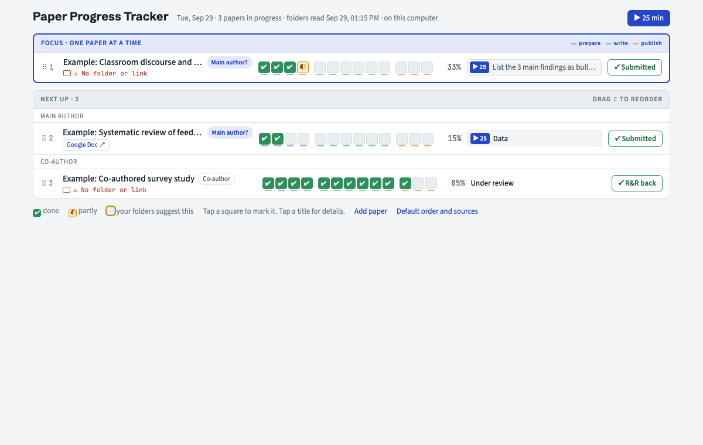

# Paper Progress Tracker

A small tracker for researchers who write many papers at once. It keeps one paper in focus, shows every paper's progress as one line, breaks writing into 25-minute pieces, and cheers you on when a stage is done.



It runs on your own computer, works without internet, and keeps your data in plain JSON files next to the app. No account, no cloud, no dependencies beyond Python 3.

## What it does

- **One line per paper.** Thirteen stage squares from idea to acceptance (prepare, write, publish). Tap a square to mark it done or partly done.
- **One paper in focus.** The top block holds exactly one paper you can write on now. Drag the ⠿ handle to rank papers, or drop a paper into the Main author or Co-author area to change your role.
- **One done button per paper.** It always offers the next milestone: Submitted, R&R back, Resubmitted, Accepted. Every action has Undo.
- **25-minute pieces.** Break a stage into pieces you can finish in one session. A coach flags vague pieces ("work on results") and asks you to name the result ("Draft 150 words on H4").
- **Pomodoro timer.** 25 minutes of focus, a soft chime, then a 5-minute break (15 after every fourth session). Only sessions of 20 minutes or more are counted.
- **Encouragement that is not flattery.** After each finished stage you see what you actually achieved plus a short message based on research about motivation and writing (small wins, goal gradient, implementation intentions, self-compassion after reviews). The sources are listed in the app.
- **Your folders, read-only.** Point a paper at its folder. Paper Progress Tracker reads it on start: the latest version (it understands v01, v02, final and dates in file names), word count change, your position in the author line, and hints such as a reviewer letter. It never changes, moves or deletes your files.
- **Links.** Add OneDrive, SharePoint, Google Docs or Drive, Overleaf or Dropbox links to any paper. Papers that moved to a shared online document can be marked as such, so local drafts are not mistaken for the current version.
- **Journal list.** Load your institution's list of recognised journals (.xlsx or .csv). Each paper then shows whether its target journal is on the list.
- **Works offline.** Everything except the optional "Break down with Claude" button.

## Start

You need Python 3.9 or newer (macOS already has it).

```bash
git clone https://github.com/NevergiveupGJ/Paper-progress-tracker.git
cd Paper-progress-tracker
cp config.example.json config.json   # then edit it, see below
./start.command
```

On macOS you can also double-click `start.command`. It starts a small server on http://127.0.0.1:47285 (only your computer can reach it) and opens the desk. The first start loads three example papers. Delete them from each paper's details (More, Delete paper).

To use another port: `PD_PORT=48000 python3 app/server.py`.

## Settings

`config.json` (all fields optional):

| Field | What it is for |
|---|---|
| `names` | How your name appears in author lines, e.g. `["Jane Doe"]`. Used to detect whether you are first author and to highlight you. |
| `papersRoot` | The folder where your paper folders live. New folders there are offered as new papers. |
| `journalListName` | What to call your journal list, e.g. "recognised journals". |
| `onlineUrl` | Optional link shown in the header, e.g. to an online copy. |

## Your data

- `data/` holds your papers, pieces and settings as JSON files. It is created on first start and is ignored by git.
- `backups/` gets one zip of `data/` per day.
- A deleted record is moved to `data/_trash`, never erased.
- Nothing is sent anywhere. The only outside requests are Google Fonts (optional, the page falls back to system fonts) and, when you load an .xlsx journal list, the SheetJS library from cdnjs.

## Files

| Path | Role |
|---|---|
| `app/source.html` | The whole app (HTML, CSS, vanilla JS). `app/build_local.py` wraps it into `app/index.html`. |
| `app/server.py` | Local server and JSON store (Python standard library only). |
| `scan_folders.py` | Read-only folder reader: latest version, word counts, author position, stage hints. |
| `sample-data/` | Example papers copied into `data/` on first start. |

## Optional: with Claude

The same page also runs as a [Claude](https://claude.ai) artifact, where it can ask Claude to break a stage into pieces. The "What I know" cards, journal suggestions and 25-minute pieces can be written by any tool that writes the same JSON files (`data/context`, `data/venues`, `data/plan`), for example Claude Code reading your own folders. The tracker only displays them.

## Credits

Built by [@NevergiveupGJ](https://github.com/NevergiveupGJ) with Claude Code. The encouragement messages are based on work by Amabile and Kramer, Kivetz and colleagues, Locke and Latham, Gollwitzer and Sheeran, Mueller and Dweck, Deci and colleagues, Breines and Chen, Boice, Sword, Silvia, Belcher, Wohl and colleagues, Walton and Cohen, and others. Full references are in the app under "Default order and sources".

## License

MIT, see [LICENSE](LICENSE).
